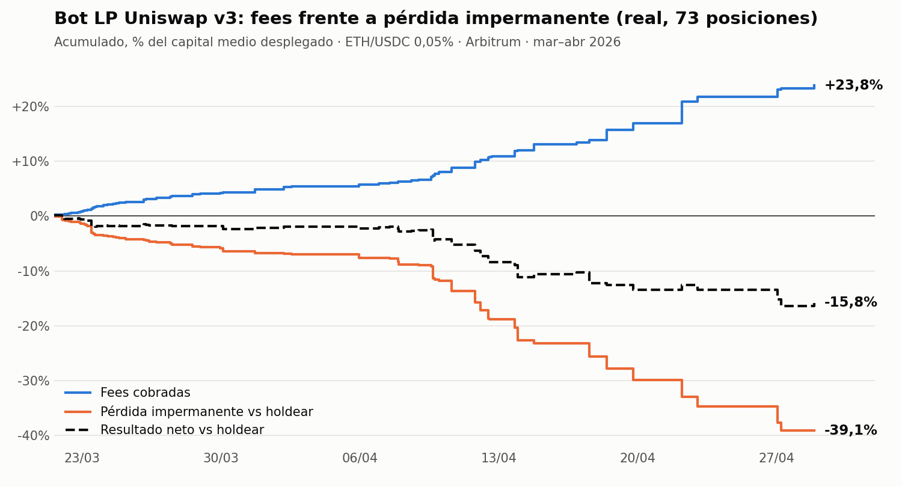

# Bot de liquidez concentrada en Uniswap v3: por qué lo descarté

[English](README.md) · **Español**

**En una línea:** construí un bot que gestionaba liquidez concentrada ETH/USDC en Arbitrum con dinero real. En 6 semanas y 73 posiciones cobró un +23,8% en fees, pero perdió un −39,1% por pérdida impermanente. El resultado fue **−15,8% frente a simplemente holdear**. Lo descarté.

## La hipótesis

La liquidez concentrada de Uniswap v3 cobra muchas más fees por dólar que un rango completo, a cambio de más pérdida impermanente (IL). La idea era que un bot que ajustara el ancho del rango a la volatilidad del momento, y que saliera y reentrara con reglas, podría cobrar más fees de lo que perdía en IL.

## Qué construí

Un bot en producción sobre el pool WETH/USDC 0,05% de Arbitrum, con capital propio:

- **Calibrador adaptativo:** aprendía el ancho del rango por régimen de volatilidad (bajo, medio, alto y extremo) a partir del resultado de cada posición cerrada.
- **Filtro de entrada por ATR:** no abría posición si la volatilidad de la última hora superaba un umbral.
- **Salida asimétrica fuera de rango:** cerraba de inmediato si el precio salía por abajo y esperaba un margen si salía por arriba, por si rebotaba.
- **Rebalanceo "inteligente":** cerraba antes de tiempo si el precio caía dentro del rango y la posición aún iba en ganancia.
- Dashboard, notificaciones por Telegram y más de 40 scripts de backtest. **Ningún cambio llegaba a producción sin pasar antes por un backtest.**

También descarté ideas antes de ponerlas en producción. Desplazar el rango según la tendencia mejoraba el backtest base, pero contaminaba la señal del calibrador y empeoraba el resultado global. Repartir más liquidez en una mitad del rango ni siquiera es posible en Uniswap v3 dentro de una sola posición.

## Resultados reales

Del 16 de marzo al 28 de abril de 2026: 87 posiciones abiertas, de las que 73 tienen datos completos de entrada y cierre. Cada posición duró de media 11,6 horas, con un rango medio del 3,4% del precio.

| Concepto | % del capital medio |
|---|---|
| Fees cobradas | +23,8% |
| Pérdida impermanente frente a holdear | −39,1% |
| Gas | −0,5% |
| **Resultado frente a holdear** | **−15,8%** |
| Resultado absoluto (con ETH subiendo un 7,6% en el periodo) | −10,1% |

- **Posiciones que ganaron a holdear:** 27 de 73.
- **Ratio IL/fees:** 1,65. Para plantear añadir capital, el objetivo era que bajara de 0,80.
- **El gas en Arbitrum no fue el problema:** supuso un 0,5% del capital en total.

**Resultado por motivo de cierre:**

| Motivo | Posiciones | Fees | IL |
|---|---|---|---|
| Salida por arriba del rango | 21 | +11,2% | −23,5% |
| Salida por abajo del rango | 20 | +6,9% | −12,4% |
| Rebalanceo anticipado | 19 | +4,4% | −2,2% |

La mayor parte de la pérdida vino de las **salidas por arriba**. Cuando el precio sube y sale del rango, la posición queda toda en USDC, así que el pool te ha ido vendiendo el ETH por el camino. Al reabrir más arriba, lo vuelves a comprar más caro. Cada rebalanceo convierte en realizada una pérdida que en un rango completo sería temporal.

## El error que encontré en mi propia métrica

Al preparar este análisis descubrí que el bot **no medía bien la IL**. Calculaba `max(0, valor de entrada − valor actual de la posición)`, que en realidad es la pérdida frente al capital inicial, recortada a cero. Eso tenía dos efectos:

- **Cuando ETH bajaba,** contaba como IL la caída del precio, que habría sufrido igual holdeando.
- **Cuando ETH subía,** la métrica daba cero, y justo ahí estaba la mayor IL real (las salidas por arriba de la tabla anterior).

Esa métrica era además **la señal con la que aprendía el calibrador**. Durante semanas el bot optimizó el ancho de rango para evitar las caídas de precio, no la pérdida impermanente. La conclusión final no cambia, porque la IL real también supera a las fees. Pero la lección es clara: **antes de optimizar nada, hay que comprobar que la métrica mide lo que crees que mide, y contra qué referencia.**

## Por qué pierde (y no era un problema de ajustes)

Con rangos estrechos, la posición se comporta como vender volatilidad. Los arbitrajistas actualizan el precio del pool contra los mercados centralizados, y el LP siempre queda del lado perdedor de ese ajuste. La literatura lo llama *loss-versus-rebalancing* (LVR; Milionis, Moallemi, Roughgarden y Zhang, 2022). En un pool con un 0,05% de comisión y un activo tan volátil como ETH, las fees no alcanzan a compensarlo. Ningún filtro de entrada ni ninguna regla de salida cambia ese balance de fondo: como mucho eligen *cuándo* pagas la pérdida.

## Qué me llevé

- **Validar con dinero pequeño antes de escalar.** Los criterios para añadir capital (ratio IL/fees < 0,80, 50 posiciones cerradas, 14 días activo) evitaron que la pérdida fuera mayor.
- **Comparar siempre contra holdear.** Un resultado absoluto positivo en un mercado alcista puede esconder que la estrategia destruye valor.
- **Auditar la métrica antes que la estrategia.** Un optimizador con una señal equivocada se vuelve más eficiente en la dirección equivocada.
- **Saber descartar.** Este proyecto dio origen a mi forma de trabajar actual: backtest, validación fuera de muestra y paper trading antes de arriesgar capital.

---

*Metodología: los porcentajes son la suma del resultado de cada posición dividida por el capital medio desplegado por posición. La IL se calcula con las fórmulas de Uniswap v3 como la diferencia entre el valor de la posición al cierre y el valor de haber mantenido los tokens depositados. Datos del propio bot (entradas, cierres, fees cobradas y gas). Desarrollo del bot asistido por IA: el diseño de la estrategia, las reglas de riesgo y la validación son míos.*
