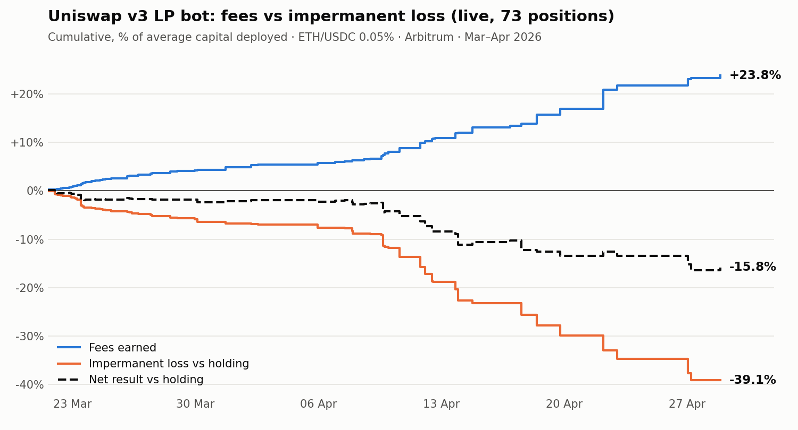

# A Uniswap v3 concentrated liquidity bot: why I shut it down

**English** · [Español](README.es.md)

**In one line:** I built a bot that managed concentrated ETH/USDC liquidity on Arbitrum with real money. Over 6 weeks and 73 positions it earned +23.8% in fees but lost −39.1% to impermanent loss. The result was **−15.8% versus simply holding**. I shut it down.

## The hypothesis

Concentrated liquidity on Uniswap v3 earns far more fees per dollar than a full range, at the cost of higher impermanent loss (IL). The idea was that a bot adjusting the range width to current volatility, and exiting and re-entering by rules, could earn more in fees than it lost to IL.

## What I built

A production bot on the Arbitrum WETH/USDC 0.05% pool, running on my own capital:

- **Adaptive calibrator:** learned the range width for each volatility regime (low, medium, high, extreme) from the outcome of every closed position.
- **ATR entry filter:** skipped opening a position when volatility over the last hour exceeded a threshold.
- **Asymmetric out-of-range exit:** closed immediately when the price left the range on the downside, and waited for a margin on the upside in case it bounced back.
- **"Smart" rebalance:** closed early when the price was falling inside the range while the position was still in profit.
- A dashboard, Telegram alerts and more than 40 backtest scripts. **No change reached production without passing a backtest first.**

I also discarded ideas before they reached production. Shifting the range with the trend improved the baseline backtest, but it polluted the calibrator's learning signal and made the overall result worse. Weighting more liquidity into one half of the range is not even possible within a single Uniswap v3 position.

## Live results

From 16 March to 28 April 2026: 87 positions opened, 73 of them with complete entry and exit data. The average position lasted 11.6 hours, with an average range width of 3.4% of the price.

| Item | % of average capital |
|---|---|
| Fees earned | +23.8% |
| Impermanent loss vs holding | −39.1% |
| Gas | −0.5% |
| **Result vs holding** | **−15.8%** |
| Absolute result (ETH rose 7.6% over the period) | −10.1% |

- **Positions that beat holding:** 27 of 73.
- **IL/fees ratio:** 1.65. Adding capital was only on the table if it dropped below 0.80.
- **Gas on Arbitrum was not the problem:** 0.5% of capital in total.

**Result by exit reason:**

| Exit reason | Positions | Fees | IL |
|---|---|---|---|
| Price left the range upward | 21 | +11.2% | −23.5% |
| Price left the range downward | 20 | +6.9% | −12.4% |
| Early rebalance | 19 | +4.4% | −2.2% |

Most of the loss came from **upside exits**. When the price rises out of the range, the position ends up entirely in USDC: the pool has sold your ETH on the way up. Re-opening higher means buying it back at a higher price. Every rebalance turns into a realized loss what would only be a temporary one in a full-range position.

## The bug I found in my own metric

While preparing this analysis I found that the bot **was not measuring IL correctly**. It computed `max(0, entry value − current position value)`, which is really the loss against the initial capital, floored at zero. That had two effects:

- **When ETH fell,** it counted the price drop as IL, even though holding would have suffered it too.
- **When ETH rose,** the metric read zero, and that is exactly where most of the real IL was (the upside exits in the table above).

That metric was also **the signal the calibrator learned from**. For weeks the bot tuned its range width to avoid price drops, not impermanent loss. The final conclusion does not change, since real IL also exceeds fees. But the lesson is clear: **before optimizing anything, check that the metric measures what you think it measures, and against which benchmark.**

## Why it loses (and why tuning was never going to fix it)

With narrow ranges, the position behaves like selling volatility. Arbitrageurs move the pool price in line with centralized exchanges, and the LP is always on the losing side of that update. The literature calls this *loss-versus-rebalancing* (LVR; Milionis, Moallemi, Roughgarden and Zhang, 2022). In a 0.05% pool on an asset as volatile as ETH, fees do not cover it. No entry filter or exit rule changes that underlying balance; at best they choose *when* you pay the loss.

## What I took away

- **Validate with small money before scaling.** The criteria for adding capital (IL/fees ratio < 0.80, 50 closed positions, 14 days live) kept the loss from growing.
- **Always compare against holding.** A positive absolute result in a rising market can hide a strategy that destroys value.
- **Audit the metric before the strategy.** An optimizer with the wrong signal just gets more efficient in the wrong direction.
- **Know when to drop an idea.** This project shaped how I work today: backtest, out-of-sample validation and paper trading before risking capital.

---

*Methodology: percentages are the sum of each position's result divided by the average capital deployed per position. IL is computed with the Uniswap v3 formulas as the difference between the position's value at close and the value of holding the deposited tokens. Data comes from the bot's own records (entries, exits, fees collected and gas). The bot was built with AI-assisted development; the strategy design, risk rules and validation are mine.*
