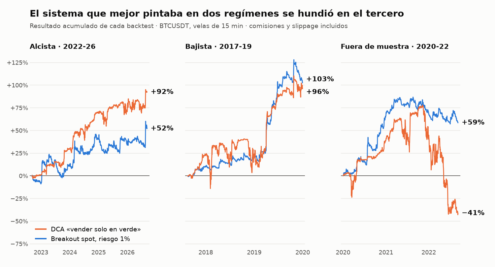

# Laboratorio de trading sistemático: 8 sistemas en paper trading y lo que descarté por el camino

[English](README.md) · **Español**

**En una línea:** monté un backtester y un laboratorio con 8 sistemas de trading sobre BTC funcionando 24/7 en paper trading. Validar cada idea en tres regímenes de mercado desmontó la que mejor pintaba: un DCA que daba **+92% y +96%** en los dos primeros periodos y **−41%** en el tercero. Ningún sistema tiene capital real todavía.

## La pregunta

Después de descartar el [bot de liquidez de Uniswap v3](../01-uniswap-v3-lp-bot/README.es.md) quería saber si alguna regla sencilla de trading sobre BTC aguanta fuera del periodo en el que se diseñó. No buscaba el sistema que más gana en un backtest, sino el que no se rompe cuando cambia el mercado.

## Qué construí

- **Un backtester propio** sobre 317.000 velas de 15 minutos de BTCUSDT (agosto 2017 a septiembre 2026). Las comisiones (0,05%) y el slippage (0,02%) se registran por separado en cada operación, nunca escondidos en el precio.
- **Dos auditorías automáticas en cada informe:** una comprueba que ninguna señal usa datos del futuro y otra que la contabilidad cuadra operación por operación.
- **Resolución intrabar conservadora:** si una vela de 15 minutos cruza dos niveles, se asume que toca primero el más cercano a la apertura. Es el supuesto que perjudica al sistema.
- **8 motores de paper trading como servicios de Linux,** cada uno con su dashboard web. Leen el precio cada 15 segundos, guardan el estado de forma atómica y se recuperan solos de reinicios y cortes de red.
- **El mismo código de señal en el backtest y en vivo,** para que lo que se prueba y lo que se ejecuta no puedan divergir.

## El método: tres regímenes

Cada idea tiene que pasar por tres periodos distintos antes de llegar a paper trading:

| Régimen | Periodo | Buy & Hold | Peor caída de BTC |
|---|---|---|---|
| Alcista | sep 2022 – sep 2026 | +270% | −54% |
| Bajista | ago 2017 – dic 2019 | +69% | −84% |
| Fuera de muestra | ene 2020 – sep 2022 | +169% | −74% |

El tercer periodo no se usó para decidir nada en la primera ronda de sistemas. Se reservó para comprobar lo que ya parecía bueno.

## Resultados del backtest

Retorno total y, entre paréntesis, caída máxima:

| Sistema | Alcista | Bajista | Fuera de muestra |
|---|---|---|---|
| Breakout long/short, riesgo 0,5% | +17% (−18%) | +78% (−8%) | +29% (−12%) |
| **Breakout spot, riesgo 1%** | +52% (−23%) | +103% (−16%) | +59% (−16%) |
| DCA «vender solo en verde» | +92% (−11%) | +96% (−37%) | **−41% (−70%)** |
| Rebalanceo por ondas FVG, con filtro de precio medio | +46% (−16%) | +78% (−55%) | +159% (−36%) |
| Rebalanceo por ruptura de estructura, sin filtro | +105% (−29%) | +2% (−65%) | +185% (−42%) |
| Buy & Hold | +270% (−54%) | +69% (−84%) | +169% (−74%) |

**Ningún sistema bate a holdear BTC en retorno en el periodo alcista.** Lo que compran es una caída mucho menor. El breakout en spot es el único con Sharpe positivo y caída máxima por debajo del 25% en los tres regímenes (Sharpe 0,71, 1,65 y 1,17, frente a 0,93, 0,68 y 0,88 de holdear).

## Lo que descarté, y por qué

**El DCA que solo vende en ganancia.** Compraba más en cada caída del 5% y solo vendía por encima del precio medio. En los dos primeros regímenes era el mejor del laboratorio: +92% con una caída máxima del 11%, y todas las operaciones cerradas en positivo. En el periodo reservado quedó atrapado en la caída de 2022 con 5 niveles de compra abiertos y terminó en −41%. Un 100% de operaciones ganadoras no decía nada del riesgo: la pérdida estaba en la posición que nunca se cerraba.

**El lado corto del breakout.** Con el mismo riesgo por operación, quitar los cortos y quedarse en efectivo mejoró el Sharpe en dos de los tres regímenes (de 0,38 a 0,73 en alcista y de 0,90 a 1,16 fuera de muestra) con la mitad de operaciones. Los cortos solo compensaron en el periodo bajista.

**El filtro de precio medio como solución universal.** El filtro solo deja comprar por debajo del precio medio de compra y vender por encima. En bajista ayuda (+78% frente a +39% sin filtro). En una tendencia alcista larga el precio queda siempre por encima del precio medio, el sistema solo vende y la cartera termina con un 0,7% en BTC: +46% frente a +115% sin filtro. Es una asimetría de la regla, no un problema de ajuste.

**El corto de ETH con colateral estable.** Una regla que amplía el corto cuando ETH sube y lo reduce cuando baja. El backtest la liquida en enero de 2018 y en noviembre de 2020. Sigue en paper trading como control, no como candidata.

## Una señal de diseño propio

La ruptura de estructura sigue, en una onda alcista, el mínimo más alto de las velas diarias. La primera vela que cierra entera por debajo de ese nivel confirma el cambio de onda y lo deja armado como nivel de venta, que se ejecuta si el precio vuelve a subir hasta él. En onda bajista es simétrico con el máximo más bajo.

Comparada con los Fair Value Gaps sobre el mismo motor de rebalanceo, da un resultado parecido con cerca del doble de operaciones (87 frente a 53 en el periodo alcista). Gana fuera de muestra y pierde con claridad en bajista, donde sin filtro se queda en +2% con una caída del 65%. Por eso las dos señales siguen en paper y ninguna ha pasado a capital real.

## Paper trading en vivo

Estado a 2 de octubre de 2026, con 10.000 USD simulados por sistema:

| Sistema | En marcha desde | Resultado | Caída máxima | Operaciones | BTC en el periodo |
|---|---|---|---|---|---|
| Breakout long/short | 8 sep | +0,1% | −1,9% | 11 | +8,9% |
| Breakout spot, riesgo 1% | 8 sep | +2,3% | −3,8% | 5 | +9,2% |
| Ondas FVG 20% con filtro | 8 sep | +5,7% | −3,5% | 2 | +9,1% |
| Ondas FVG 10% con filtro | 8 sep* | +5,1% | −3,2% | 2 | +9,1% |
| Ruptura de estructura 20% | 14 sep | +4,2% | −2,3% | 2 | +10,2% |
| Ruptura de estructura 10% | 14 sep* | +4,7% | −2,5% | 2 | +10,2% |
| Corto ETH, colateral estable | 18 sep | −0,8% | −1,3% | 1 | ETH +8,3% |
| Rebalanceo EMA 50/150 | 27 sep | +0,6% | −1,5% | 0 | +1,3% |

*\* Las variantes del 10% se añadieron el 22 de septiembre. Su histórico se reconstruyó aplicando el nuevo tamaño a las mismas señales ya ejecutadas.*

Tres semanas no permiten concluir nada sobre rentabilidad, y con BTC subiendo un 9% todos los sistemas van por detrás de holdear, como predice el backtest para un tramo alcista. Lo que esta fase sí comprueba es la operativa: los ocho motores llevan desde su arranque registrando equity cada minuto sin huecos de más de 15 minutos.

## Qué me llevé

- **Reservar un periodo que no se toca.** La validación fuera de muestra fue lo único que distinguió un sistema robusto de un espejismo. Las métricas de los dos primeros periodos no lo hacían.
- **Desconfiar del porcentaje de aciertos.** Una regla que nunca vende en pérdida tiene un 100% de aciertos por construcción y esconde el riesgo en la posición abierta.
- **Holdear es el rival, no cero.** En un mercado alcista casi cualquier regla gana dinero y casi ninguna gana a no hacer nada.
- **Una regla que ayuda en un régimen puede dañar en otro.** Los cortos y el filtro de precio medio mejoraron el periodo bajista y empeoraron el alcista.
- **Paper trading antes que capital.** Sirve para comprobar que el sistema en vivo hace lo mismo que el backtest, no para confirmar que gana.

---

*Metodología: backtests sobre BTCUSDT de Binance en velas de 15 minutos, con un capital inicial de 10.000 USD, comisión del 0,05% y slippage del 0,02% por lado. Los sistemas de rebalanceo parten de una cartera 50% BTC y 50% USD y mueven el 20% del lado disponible en cada señal. El periodo 2020-2022 fue fuera de muestra en sentido estricto para el breakout y el DCA; los sistemas de ondas se diseñaron después y para ellos es un tercer régimen de comprobación. El backtest del rebalanceo EMA usa velas de 1 hora y no se incluye en la tabla. Resultados pasados y simulados no garantizan resultados futuros. Desarrollo asistido por IA: el diseño de las estrategias, las reglas de riesgo y la validación son míos.*
