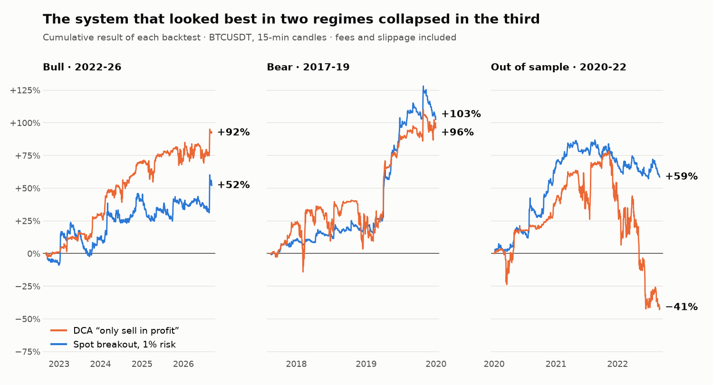

# A systematic trading lab: 8 systems in paper trading, and what I discarded along the way

**English** · [Español](README.es.md)

**In one line:** I built a backtester and a lab of 8 BTC trading systems running 24/7 in paper trading. Validating every idea across three market regimes took apart the one that looked best: a DCA system that returned **+92% and +96%** in the first two periods and **−41%** in the third. No system has real capital yet.

## The question

After shutting down the [Uniswap v3 liquidity bot](../01-uniswap-v3-lp-bot/README.md), I wanted to know whether any simple BTC trading rule holds up outside the period it was designed on. I was not looking for the system that earns the most in one backtest, but for the one that does not break when the market changes.

## What I built

- **A custom backtester** over 317,000 15-minute BTCUSDT candles (August 2017 to September 2026). Fees (0.05%) and slippage (0.02%) are recorded separately on every trade, never hidden in the price.
- **Two automatic audits on every report:** one checks that no signal uses future data, the other that the accounting reconciles trade by trade.
- **Conservative intrabar resolution:** when a 15-minute candle crosses two levels, the one closest to the open is assumed to be hit first. That is the assumption that hurts the system.
- **8 paper trading engines running as Linux services,** each with its own web dashboard. They poll the price every 15 seconds, save state atomically and recover on their own from restarts and network outages.
- **The same signal code in the backtest and live,** so what is tested and what is executed cannot drift apart.

## The method: three regimes

Every idea has to go through three different periods before it reaches paper trading:

| Regime | Period | Buy & Hold | Worst BTC drawdown |
|---|---|---|---|
| Bull | Sep 2022 – Sep 2026 | +270% | −54% |
| Bear | Aug 2017 – Dec 2019 | +69% | −84% |
| Out of sample | Jan 2020 – Sep 2022 | +169% | −74% |

The third period was not used to decide anything in the first round of systems. It was held back to check what already looked good.

## Backtest results

Total return, with maximum drawdown in parentheses:

| System | Bull | Bear | Out of sample |
|---|---|---|---|
| Breakout long/short, 0.5% risk | +17% (−18%) | +78% (−8%) | +29% (−12%) |
| **Spot breakout, 1% risk** | +52% (−23%) | +103% (−16%) | +59% (−16%) |
| DCA "only sell in profit" | +92% (−11%) | +96% (−37%) | **−41% (−70%)** |
| FVG wave rebalancing, with average-price filter | +46% (−16%) | +78% (−55%) | +159% (−36%) |
| Structure-break rebalancing, no filter | +105% (−29%) | +2% (−65%) | +185% (−42%) |
| Buy & Hold | +270% (−54%) | +69% (−84%) | +169% (−74%) |

**No system beats holding BTC on return in the bull period.** What they buy is a much smaller drawdown. The spot breakout is the only one with a positive Sharpe ratio and a maximum drawdown under 25% in all three regimes (Sharpe 0.71, 1.65 and 1.17, against 0.93, 0.68 and 0.88 for holding).

## What I discarded, and why

**The DCA that only sells in profit.** It bought more on every 5% drop and only sold above its average price. In the first two regimes it was the best system in the lab: +92% with an 11% maximum drawdown, and every closed trade a winner. In the held-back period it got trapped in the 2022 decline with 5 buy levels open and ended at −41%. A 100% win rate said nothing about the risk: the loss sat in the position that never closed.

**The short side of the breakout.** At the same risk per trade, dropping the shorts and sitting in cash improved the Sharpe ratio in two of the three regimes (from 0.38 to 0.73 in the bull period and from 0.90 to 1.16 out of sample) with half the trades. The shorts only paid off in the bear period.

**The average-price filter as a universal fix.** The filter only allows buying below the average purchase price and selling above it. In a bear market it helps (+78% against +39% without it). In a long uptrend the price stays above the average price, the system only sells, and the portfolio ends up 0.7% in BTC: +46% against +115% without the filter. That is an asymmetry in the rule, not a tuning problem.

**The ETH short with stable collateral.** A rule that adds to the short when ETH rises and reduces it when ETH falls. The backtest liquidates it in January 2018 and again in November 2020. It stays in paper trading as a control, not as a candidate.

## A signal of my own design

The structure break follows, during an up-wave, the highest low of the daily candles. The first candle that closes entirely below that level confirms the change of wave and arms the level as a sell trigger, executed if the price climbs back to it. In a down-wave it is symmetric, using the lowest high.

Compared with Fair Value Gaps on the same rebalancing engine, it gives a similar result with roughly twice the trades (87 against 53 in the bull period). It wins out of sample and loses clearly in the bear period, where without a filter it ends at +2% with a 65% drawdown. That is why both signals are still in paper trading and neither has moved to real capital.

## Live paper trading

Status on 2 October 2026, with a simulated 10,000 USD per system:

| System | Running since | Result | Max drawdown | Trades | BTC over the period |
|---|---|---|---|---|---|
| Breakout long/short | 8 Sep | +0.1% | −1.9% | 11 | +8.9% |
| Spot breakout, 1% risk | 8 Sep | +2.3% | −3.8% | 5 | +9.2% |
| FVG waves 20%, with filter | 8 Sep | +5.7% | −3.5% | 2 | +9.1% |
| FVG waves 10%, with filter | 8 Sep* | +5.1% | −3.2% | 2 | +9.1% |
| Structure break 20% | 14 Sep | +4.2% | −2.3% | 2 | +10.2% |
| Structure break 10% | 14 Sep* | +4.7% | −2.5% | 2 | +10.2% |
| ETH short, stable collateral | 18 Sep | −0.8% | −1.3% | 1 | ETH +8.3% |
| EMA 50/150 rebalancing | 27 Sep | +0.6% | −1.5% | 0 | +1.3% |

*\* The 10% variants were added on 22 September. Their history was rebuilt by applying the new size to the same signals already executed.*

Three weeks say nothing about profitability, and with BTC up 9% every system is behind holding, as the backtest predicts for a rising market. What this phase does check is operations: since launch, all eight engines have logged equity every minute with no gap longer than 15 minutes.

## What I took away

- **Hold back a period you never touch.** Out-of-sample validation was the only thing that told a robust system from a mirage. The metrics from the first two periods did not.
- **Distrust the win rate.** A rule that never sells at a loss has a 100% win rate by construction and hides its risk in the open position.
- **The benchmark is holding, not zero.** In a bull market almost any rule makes money and almost none beats doing nothing.
- **A rule that helps in one regime can hurt in another.** The shorts and the average-price filter improved the bear period and made the bull period worse.
- **Paper trading before capital.** It is there to confirm that the live system does what the backtest did, not to confirm that it wins.

---

*Methodology: backtests on Binance BTCUSDT 15-minute candles, starting from 10,000 USD, with a 0.05% fee and 0.02% slippage per side. The rebalancing systems start from a 50% BTC / 50% USD portfolio and move 20% of the available side on each signal. The 2020-2022 period was strictly out of sample for the breakout and the DCA; the wave systems were designed later, so for them it is a third check regime. The EMA rebalancing backtest uses 1-hour candles and is not included in the table. Past and simulated results do not guarantee future results. Built with AI-assisted development; the strategy design, risk rules and validation are mine.*
