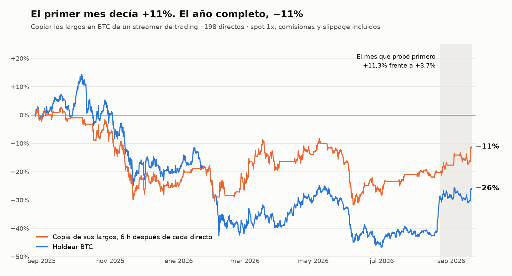

# Copiar a un streamer de trading: el primer mes daba +11% y el año completo −11%

[English](README.md) · **Español**

**En una línea:** antes de construir un bot que copiara los largos en BTC de un streamer de trading muy seguido, reconstruí su posición a partir de 198 directos y la simulé. El primer mes que probé daba **+11,3%** con 3 operaciones ganadoras de 3. Con el año completo, la misma regla da **−11,2%**, y con apalancamiento 5x se liquida. No construí el bot.

## La pregunta

Sigo a un analista que comenta el mercado en directo casi a diario y dice en cada sesión si está comprado o fuera de BTC. Su método mezcla indicadores con criterio propio, así que no se puede programar entero. La idea era más simple: leer cada directo y copiar su posición. Antes de escribir el bot quería saber si copiarle habría ganado dinero.

El nombre del canal no aparece a propósito. Lo que se evalúa aquí es la regla de copiarle con retraso, no a la persona, y las posiciones salen de una extracción automática que no es perfecta.

## Qué construí

- **Descarga de subtítulos** de 198 directos, de agosto de 2025 a septiembre de 2026: 192 horas de vídeo con la marca de tiempo de cada frase.
- **Extracción con un modelo de lenguaje y un esquema fijo:** para cada directo, la posición en BTC que declara al empezar y al terminar, cada apertura o cierre con el minuto en que lo dice, y la cita literal que lo respalda.
- **Un backtest de la copia** sobre velas de 1 hora, solo con largos y con cuatro retrasos de ejecución: en el minuto en que lo dice, al terminar el directo, 6 horas después y 24 horas después.
- **Dos formas de ejecutarlo:** spot sin apalancar, y perpetuos de 1x a 10x con funding y liquidación.
- **Una versión mecánica de control:** sus indicadores públicos (medias exponenciales, un oscilador de momentum y ADX) programados como regla fija y probados desde 2017.

## El primer resultado

Empecé con lo que tenía a mano, los 17 directos del último mes (22 de agosto a 19 de septiembre de 2026):

| | Resultado | Operaciones |
|---|---|---|
| Copia 6 h después del directo | +11,3% | 3 ganadoras de 3 |
| Holdear BTC | +3,7% | |
| Copia en perpetuos 5x | +62% | |
| Copia en perpetuos 10x | +145% | |

Con esto delante, lo siguiente habría sido decidir cuánto apalancar. Lo que hice fue descargar el año entero antes de tocar nada más.

## El año completo

De agosto de 2025 a septiembre de 2026, con BTC bajando de 109.700 a 81.300 USD:

| Ejecución | Resultado | Caída máxima |
|---|---|---|
| Copia en el minuto en que lo dice | −9,3% | −33% |
| Copia al terminar el directo | −9,8% | −32% |
| **Copia 6 h después** | **−11,2%** | **−35%** |
| Copia 24 h después | −28,3% | −47% |
| Holdear BTC | −25,9% | −54% |

La copia pierde menos que holdear en un año bajista, y estuvo fuera del mercado un tercio del tiempo. Pero pierde, y esperar un día a ejecutar borra toda la ventaja.

**Las pérdidas vienen de tres operaciones.** De 27 operaciones, 18 cerraron en ganancia, con una ganancia media del 3,0% y una pérdida media del 6,7%. Las tres peores (−18,2%, −15,0% y −12,3%) se mantuvieron abiertas 66, 31 y 11 días. Sin ellas, las otras 24 suman +45,6%. Las tres juntas restan un 39,0%. No hay stop: una posición en rojo se aguanta hasta que él la cierra, y la peor llegó a ir un 24,6% por debajo de la entrada.

**Con apalancamiento no se llega a fin de año.**

| Apalancamiento | Primer mes | Año completo |
|---|---|---|
| 1x | +10,8% | −17,4% |
| 2x | +22,4% | −41,4% |
| 3x | +34,8% | −66,9% |
| 5x | +61,9% | liquidada el 20 nov 2025 |
| 10x | +144,8% | liquidada el 13 nov 2025 |

El mes que probé primero era el mejor tramo de todo el periodo para esta regla. Si hubiera decidido el apalancamiento con él, habría elegido justo los niveles que se liquidan.

## Lo que no cuento como resultado

**Un stop lo arregla sobre el papel.** Añadir a la copia un stop de entre el 5% y el 10% deja el año entre +6% y +18%. No lo doy por bueno: probé diez stops distintos después de ver los datos, sobre 27 operaciones, y el resultado depende de tres de ellas. Con un stop del 15% el año se queda en −11% si es fijo y en 0% si es trailing. Es una hipótesis para probar hacia delante en paper trading, no una conclusión. Además, con stop ya no es copiarle: es otro sistema.

**La versión mecánica tampoco lo reproduce.** Sus indicadores como regla fija dan −18,7% en el mismo año, con solo un 12% del tiempo en mercado. Desde 2017 la regla protege en las caídas (caída máxima del 38% frente al 84% de BTC), pero gana +184% frente a +1.625% de holdear. Lo que él aporta en directo, si aporta algo, no está en los indicadores.

## Limitaciones

- **La posición la extrae un modelo de una transcripción automática.** En 43 de los 198 directos no declara con claridad cómo está, y la simulación mantiene la posición anterior. Al revisar las 27 operaciones contra las citas, 16 de las 54 entradas y salidas no tienen detrás una apertura o un cierre explícito: salen de la posición que el modelo dedujo. La extracción además no separa bien sus operaciones de futuros de una compra de spot a largo plazo, y una de las tres peores operaciones (la de −15,0%) viene de esa confusión. Las cifras del año son por tanto orientativas hasta rehacer la extracción.
- **Se copia una posición, no una operativa.** Él opera con varios tamaños, promedia y reduce. La simulación solo distingue entre estar dentro y estar fuera.
- **Es un solo año y bajista.** 27 operaciones no permiten afirmar que la regla pierde siempre, solo que el primer mes no era representativo.

## Qué me llevé

- **Un mes no es una muestra.** Tres operaciones ganadoras de tres no decían nada. El año entero tenía los tres casos que importaban.
- **Descargar todo el histórico antes de decidir el tamaño.** El apalancamiento que parecía razonable con el primer mes es el que liquida la cuenta con el año.
- **Mirar cuánto llega a perder una posición abierta, no solo cómo cierra.** El 67% de aciertos convivía con una posición que estuvo un 25% en contra.
- **El retraso es parte de la estrategia.** Entre copiar al terminar el directo y copiar un día después hay 18 puntos de diferencia.
- **Un arreglo encontrado después de ver los datos es una hipótesis.** Se prueba hacia delante, no se da por validado.

---

*Metodología: BTCUSDT de Binance en velas de 1 hora. Spot con un coste del 0,07% por lado (comisión del pool y slippage). Perpetuos con un 0,065% por lado, funding estimado del 10% anual y margen de mantenimiento del 1,25%. La copia abre un largo cuando la posición declarada al final del directo es comprado y lo cierra cuando es fuera o corto. Los stops se evalúan contra el mínimo de cada vela y se ejecutan al peor precio entre el nivel y la apertura. Resultados simulados; no son una valoración del rendimiento real del analista. Desarrollo asistido por IA: el diseño de la validación y las conclusiones son míos.*
