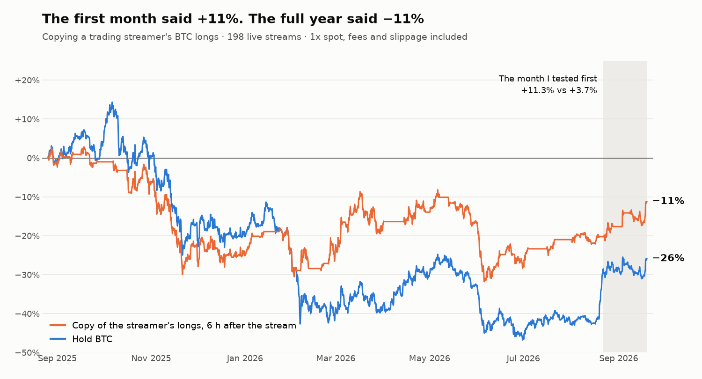

# Copying a trading streamer: the first month said +11%, the full year said −11%

**English** · [Español](README.es.md)

**In one line:** before building a bot to copy the BTC longs of a widely followed trading streamer, I reconstructed the streamer's position from 198 live streams and simulated it. The first month I tested returned **+11.3%** with 3 winning trades out of 3. Over the full year the same rule returns **−11.2%**, and at 5x leverage it gets liquidated. I did not build the bot.

## The question

I follow an analyst who comments on the market live almost every day and says in each session whether they are long BTC or out. The method mixes indicators with personal judgement, so it cannot be fully coded. The idea was simpler: read each stream and copy the position. Before writing the bot, I wanted to know whether copying it would have made money.

The channel is left unnamed on purpose. What is evaluated here is the rule of copying with a delay, not the person, and the positions come from an automated extraction that is not perfect.

## What I built

- **Subtitle download** for 198 live streams, from August 2025 to September 2026: 192 hours of video with a timestamp for every sentence.
- **Extraction with a language model and a fixed schema:** for each stream, the BTC position declared at the start and at the end, every open or close with the minute it is mentioned, and the literal quote that supports it.
- **A backtest of the copy** on 1-hour candles, long only, with four execution delays: at the minute it is said, at the end of the stream, 6 hours later and 24 hours later.
- **Two ways to execute it:** unleveraged spot, and perpetuals from 1x to 10x with funding and liquidation.
- **A mechanical control version:** the streamer's public indicators (exponential moving averages, a momentum oscillator and ADX) coded as a fixed rule and tested from 2017.

## The first result

I started with what I had at hand, the 17 streams of the most recent month (22 August to 19 September 2026):

| | Result | Trades |
|---|---|---|
| Copy 6 h after the stream | +11.3% | 3 winners out of 3 |
| Hold BTC | +3.7% | |
| Copy on 5x perpetuals | +62% | |
| Copy on 10x perpetuals | +145% | |

With this in front of me, the next step would have been choosing how much leverage to use. What I did was download the whole year before touching anything else.

## The full year

From August 2025 to September 2026, with BTC falling from 109,700 to 81,300 USD:

| Execution | Result | Max drawdown |
|---|---|---|
| Copy at the minute it is said | −9.3% | −33% |
| Copy at the end of the stream | −9.8% | −32% |
| **Copy 6 h later** | **−11.2%** | **−35%** |
| Copy 24 h later | −28.3% | −47% |
| Hold BTC | −25.9% | −54% |

The copy loses less than holding in a bear year, and it was out of the market a third of the time. But it loses, and waiting a day to execute wipes out the whole advantage.

**The losses come from three trades.** Out of 27 trades, 18 closed in profit, with an average win of 3.0% and an average loss of 6.7%. The three worst ones (−18.2%, −15.0% and −12.3%) stayed open for 66, 31 and 11 days. Without them, the other 24 add up to +45.6%. The three together take away 39.0%. There is no stop: a losing position is held until the streamer closes it, and the worst one went 24.6% below its entry.

**With leverage it does not reach the end of the year.**

| Leverage | First month | Full year |
|---|---|---|
| 1x | +10.8% | −17.4% |
| 2x | +22.4% | −41.4% |
| 3x | +34.8% | −66.9% |
| 5x | +61.9% | liquidated on 20 Nov 2025 |
| 10x | +144.8% | liquidated on 13 Nov 2025 |

The month I tested first was the best stretch of the whole period for this rule. Had I chosen the leverage from it, I would have picked exactly the levels that get liquidated.

## What I do not count as a result

**A stop fixes it on paper.** Adding a stop between 5% and 10% to the copy puts the year between +6% and +18%. I do not take that as valid: I tried ten different stops after seeing the data, on 27 trades, and the outcome depends on three of them. With a 15% stop the year comes out at −11% if it is fixed and at 0% if it is trailing. It is a hypothesis to test forward in paper trading, not a conclusion. And with a stop it is no longer a copy: it is a different system.

**The mechanical version does not reproduce it either.** The indicators as a fixed rule return −18.7% over the same year, with only 12% of the time in the market. Since 2017 the rule protects in drawdowns (38% maximum drawdown versus 84% for BTC), but it earns +184% against +1,625% for holding. Whatever the streamer adds live, if anything, is not in the indicators.

## Limitations

- **The position is extracted by a model from an automatic transcript.** In 43 of the 198 streams the position is not stated clearly, and the simulation keeps the previous one. When I checked the 27 trades against the quotes, 16 of the 54 entries and exits had no explicit open or close behind them: they come from the position the model inferred. The extraction also does not cleanly separate futures trades from a long-term spot purchase, and one of the three worst trades (the −15.0% one) comes from that confusion. The full-year figures are therefore indicative until the extraction is redone.
- **It copies a position, not a trading style.** The streamer uses several sizes, averages in and scales out. The simulation only tells in from out.
- **It is a single year, and a bear one.** 27 trades do not show that the rule always loses, only that the first month was not representative.

## What I took away

- **A month is not a sample.** Three winners out of three said nothing. The full year held the three cases that mattered.
- **Download the whole history before deciding size.** The leverage that looked reasonable on the first month is the one that liquidates the account over the year.
- **Look at how far an open position goes against you, not only at how it closes.** A 67% win rate coexisted with a position that was 25% under water.
- **The delay is part of the strategy.** Between copying at the end of the stream and copying a day later there are 18 points of difference.
- **A fix found after seeing the data is a hypothesis.** It gets tested forward, not treated as validated.

---

*Methodology: Binance BTCUSDT on 1-hour candles. Spot with a cost of 0.07% per side (pool fee and slippage). Perpetuals with 0.065% per side, estimated funding of 10% per year and a 1.25% maintenance margin. The copy opens a long when the position declared at the end of the stream is long and closes it when it is flat or short. Stops are evaluated against each candle's low and filled at the worse of the stop level and the open. Simulated results; they are not an assessment of the analyst's real performance. AI-assisted development: the validation design and the conclusions are mine.*
