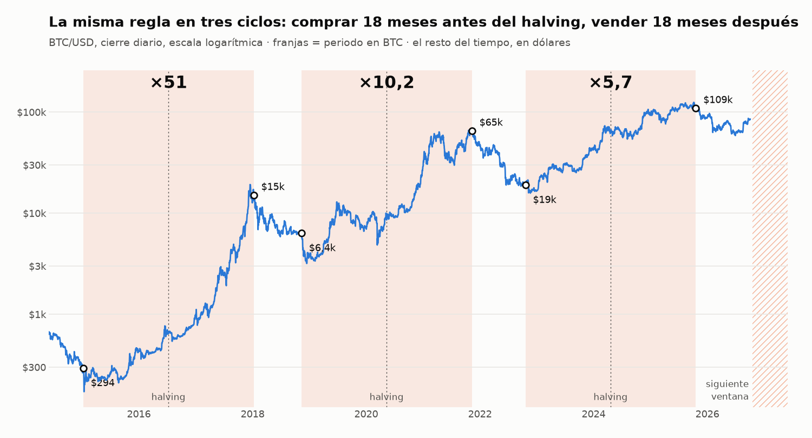

# Estrategia de ciclos del halving de BTC: una regla de calendario, tres ciclos y un cuarto en marcha

[English](README.md) · **Español**

**En una línea:** probé una regla de dos operaciones por ciclo, comprar BTC 18 meses antes de cada halving y venderlo 18 meses después, y superó a holdear en los tres ciclos con datos (**×51, ×10,2 y ×5,7** frente a ×21,6, ×3,0 y ×4,5). Después intenté mejorarla con siete formas de entrar y cinco de salir: solo una entrada lo consiguió. Son tres ciclos, no una estadística, y el cuarto empieza este mes en condiciones que el backtest no ha visto.

## La pregunta

Después de meses probando señales técnicas a corto plazo, quería saber cuánta parte del resultado de BTC a largo plazo se explica solo por el calendario. Si los máximos y los mínimos se ordenan alrededor del halving, una regla de fechas debería bastar, y cualquier indicador añadido tendría que demostrar que aporta algo.

## La regla base

- **Comprar todo** 18 meses antes del halving.
- **Vender todo** 18 meses después del halving.
- **El resto del tiempo, en dólares.**

Son cinco operaciones en once años. Cada ciclo se mide desde su compra hasta la compra del ciclo siguiente, para que la comparación con holdear incluya el mercado bajista que la regla pasa fuera.

| Ciclo | Compra | Venta | Regla | Holdear | Peor caída con la regla |
|---|---|---|---|---|---|
| Halving 2016 | 9 ene 2015 a 294 USD | 8 ene 2018 a 15.000 USD | ×51,0 | ×21,6 | −42% |
| Halving 2020 | 11 nov 2018 a 6.358 USD | 10 nov 2021 a 64.921 USD | ×10,2 | ×3,0 | −62% |
| Halving 2024 | 20 oct 2022 a 19.043 USD | 19 oct 2025 a 108.684 USD | ×5,7 | ×4,5 | −28% |

La ventaja no viene de comprar mejor, sino de no estar dentro en la caída posterior. Tras cada venta, BTC cayó un 83%, un 77% y, de momento, un 53% desde su máximo.

El tercer ciclo no ha terminado. Su ventaja sobre holdear depende del precio de hoy: con BTC en 85.200 USD es de cerca de un 28%, y en junio, con BTC en 61.000 USD, era bastante mayor.

**La regla no protege dentro de la ventana.** El −62% del segundo ciclo es marzo de 2020, en plena ventana de compra. Estar fuera en el mercado bajista no evita una caída a mitad del alcista.

## Lo que probé para mejorar la entrada

Todas las variantes comparten la misma salida. El resultado es el capital final encadenando los tres ciclos, frente a comprar en la fecha.

| Entrada | Frente a la fecha fija |
|---|---|
| Todo en la primera caída del 50% desde máximos | −67% |
| Compras mensuales desde el −50% | −46% |
| Tres tramos en −50%, −60% y −70% | −46% |
| Proporcional a la profundidad de la caída | −19% |
| Rebote del 10% desde el mínimo | −73% |
| Rebote del 20% desde el mínimo | −50% |
| **Primer cierre sobre la EMA de 50 días *después* de la fecha** | **+63%** |

- **Adelantarse sale caro.** En los tres ciclos el mínimo llegó después de la fecha de compra: 5, 34 y 32 días más tarde. Una caída del 50% no es un suelo. En 2022 el precio cayó otro 48% después de tocarla.
- **Las señales de rebote compran rebotes falsos.** Fueron las peores variantes.
- **La media solo sirve después de la fecha.** Usada antes, compra los mismos rebotes falsos. Usada después, retrasó la compra a 257 USD en lugar de 294 y a 3.870 en lugar de 6.358. En el tercer ciclo compró algo peor: 20.087 en lugar de 19.043.

Esta última es la regla de entrada que uso. Sale de comparar siete variantes sobre tres ciclos, así que puede estar sobreajustada. El ciclo actual es su primera prueba fuera de muestra.

## Lo que probé para mejorar la salida

Con la misma entrada, frente a vender en la fecha:

| Salida | Frente a la fecha fija |
|---|---|
| Ventas semanales durante dos meses alrededor de la fecha | −13% |
| Desde la fecha, primer cierre bajo la EMA de 50 días | −23% |
| Desde tres meses antes, primer cierre bajo la EMA de 50 días | −40% |
| Trailing stop del 15% desde tres meses antes | −76% |
| Trailing stop del 20% desde tres meses antes | −78% |

**Ninguna señal mejoró la fecha.** Los tres máximos llegaron 23, 2 y 13 días antes de la fecha de venta, y la venta se hizo un 22%, un 4% y un 13% por debajo del máximo. La media confirma tarde, y el trailing stop vende en las correcciones normales del mercado alcista, mucho antes del techo.

Elegí las ventas semanales aunque rinden un 13% menos en el histórico. Casi toda esa diferencia viene de 2021, cuando la fecha cayó a dos días del máximo exacto. No quiero que el resultado de tres años dependa de acertar un solo día.

## Qué pasa si el ciclo deja de funcionar

Tres ciclos no demuestran que haya un cuarto. El diseño incluye tres reglas para ese caso:

- **Una parte de BTC no se vende nunca.** Cubre el escenario en el que vendo en la fecha y el precio sigue subiendo sin volver a caer.
- **Condición de compra:** no se compra si BTC no ha caído antes al menos un 50% desde máximos. Hasta ahora siempre ha ocurrido antes de la fecha.
- **Condición de invalidación:** si pasa un ciclo entero sin esa caída, el sistema se queda en dólares y se revisa el modelo. No se improvisan entradas.

## El cuarto ciclo: una prueba que no se parece al histórico

La ventana de compra del ciclo del halving de 2028 se abre el 18 de octubre de 2026. A 4 de octubre:

- BTC tocó el −50% desde máximos el 5 de junio de 2026 y marcó el mínimo, de momento, el 30 de junio, en −53%.
- Hoy está un 32% por debajo del máximo y por encima de su EMA de 50 días. Si sigue así, la regla compra el día que se abre la ventana.
- En los tres ciclos anteriores la regla compró un 77%, un 80% y un 70% por debajo del máximo. Comprar a −32% no tiene precedente en el backtest.

Hay dos lecturas. O los mercados bajistas son cada vez menos profundos (−85%, −83%, −77% y ahora −53%) y el suelo ya pasó, o el suelo aún no ha llegado y la regla compra antes de tiempo. El backtest no distingue entre las dos. Lo que hago es no cambiar la regla a mitad de la prueba y dejar escrito, antes de que ocurra, qué resultado la invalidaría.

## Qué me llevé

- **Una regla simple puede superar a las señales.** Ningún indicador mejoró la fecha de salida, y solo uno mejoró la de entrada.
- **Con tres observaciones no hay estadística.** El resultado es una hipótesis con buen historial, y hay que dimensionar el riesgo como tal.
- **Probar la variante "obvia" antes de darla por buena.** Comprar por tramos en la caída parecía más prudente y fue peor en los tres ciclos.
- **Una regla más robusta puede rendir menos en el backtest.** Preferí perder un 13% histórico en la salida a depender de una fecha.
- **Escribir la condición de invalidación antes de entrar.** Decidir qué haría falta para abandonar la estrategia es más fácil cuando todavía no hay dinero en juego.

---

*Metodología: BTC/USD de Bitstamp en cierres diarios desde 2011. Cada operación paga un 0,05% de comisión más 0,05 USD de gas. Los 18 meses se cuentan como 18 × 30,44 días. El halving de 2028 se estima en el 19 de abril. Los multiplicadores por ciclo parten de 1.000 USD en la fecha de compra y terminan en la fecha de compra del ciclo siguiente; el tercero termina el 4 de octubre de 2026. No se incluye el rendimiento de los dólares mientras se está fuera ni los impuestos. Las fechas ±18 meses y las variantes se eligieron conociendo los tres ciclos, así que ningún resultado es fuera de muestra. Resultados pasados y simulados no garantizan resultados futuros; no es una recomendación de inversión. Desarrollo asistido por IA: el diseño de la estrategia, las reglas de riesgo y la validación son míos.*
