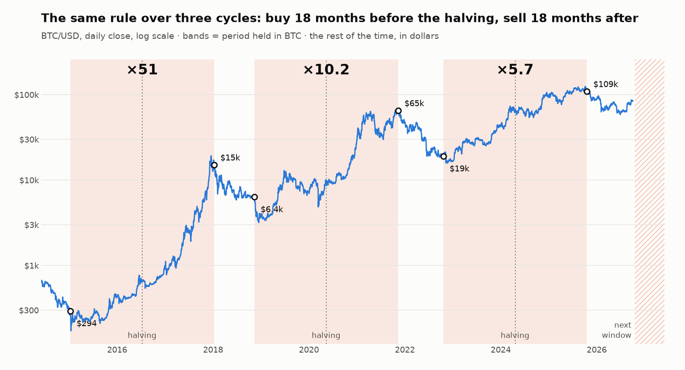

# A BTC halving-cycle strategy: one calendar rule, three cycles, and a fourth under way

**English** · [Español](README.es.md)

**In one line:** I tested a rule with two trades per cycle, buy BTC 18 months before each halving and sell it 18 months after, and it beat holding in all three cycles with data (**×51, ×10.2 and ×5.7** versus ×21.6, ×3.0 and ×4.5). Then I tried to improve it with seven ways to enter and five ways to exit: only one entry did. That is three cycles, not a statistic, and the fourth starts this month under conditions the backtest has never seen.

## The question

After months of testing short-term technical signals, I wanted to know how much of BTC's long-term result is explained by the calendar alone. If tops and bottoms line up around the halving, a date rule should be enough, and any added indicator would have to prove it contributes something.

## The base rule

- **Buy everything** 18 months before the halving.
- **Sell everything** 18 months after the halving.
- **The rest of the time, in dollars.**

That is five trades in eleven years. Each cycle is measured from its buy to the next cycle's buy, so the comparison with holding includes the bear market the rule sits out.

| Cycle | Buy | Sell | Rule | Hold | Worst drawdown with the rule |
|---|---|---|---|---|---|
| 2016 halving | 9 Jan 2015 at 294 USD | 8 Jan 2018 at 15,000 USD | ×51.0 | ×21.6 | −42% |
| 2020 halving | 11 Nov 2018 at 6,358 USD | 10 Nov 2021 at 64,921 USD | ×10.2 | ×3.0 | −62% |
| 2024 halving | 20 Oct 2022 at 19,043 USD | 19 Oct 2025 at 108,684 USD | ×5.7 | ×4.5 | −28% |

The edge does not come from buying better, but from not being in during the fall that follows. After each sale, BTC dropped 83%, 77% and, so far, 53% from its top.

The third cycle is not finished. Its edge over holding depends on today's price: with BTC at 85,200 USD it is close to 28%, and in June, with BTC at 61,000 USD, it was considerably larger.

**The rule does not protect inside the window.** The −62% in the second cycle is March 2020, in the middle of the holding window. Being out during the bear market does not avoid a crash halfway through the bull.

## What I tried to improve the entry

All variants share the same exit. The result is the final capital chaining the three cycles, relative to buying on the date.

| Entry | Versus the fixed date |
|---|---|
| All in at the first 50% drop from the top | −67% |
| Monthly buys from −50% | −46% |
| Three tranches at −50%, −60% and −70% | −46% |
| Proportional to the depth of the drop | −19% |
| 10% rebound from the low | −73% |
| 20% rebound from the low | −50% |
| **First close above the 50-day EMA *after* the date** | **+63%** |

- **Getting in early is expensive.** In all three cycles the low came after the buy date: 5, 34 and 32 days later. A 50% drop is not a floor. In 2022 the price fell another 48% after touching it.
- **Rebound signals buy false rebounds.** They were the worst variants.
- **The average only works after the date.** Used before it, it buys the same false rebounds. Used after it, it delayed the buy to 257 USD instead of 294 and to 3,870 instead of 6,358. In the third cycle it bought slightly worse: 20,087 instead of 19,043.

This last one is the entry rule I use. It comes out of comparing seven variants over three cycles, so it may be overfitted. The current cycle is its first out-of-sample test.

## What I tried to improve the exit

With the same entry, relative to selling on the date:

| Exit | Versus the fixed date |
|---|---|
| Weekly sales over two months around the date | −13% |
| From the date, first close below the 50-day EMA | −23% |
| From three months earlier, first close below the 50-day EMA | −40% |
| 15% trailing stop from three months earlier | −76% |
| 20% trailing stop from three months earlier | −78% |

**No signal improved on the date.** The three tops came 23, 2 and 13 days before the sell date, and the sale was made 22%, 4% and 13% below the top. The average confirms late, and the trailing stop sells in the ordinary corrections of a bull market, long before the top.

I chose the weekly sales even though they return 13% less historically. Almost all of that gap comes from 2021, when the date fell two days from the exact top. I do not want three years of results to depend on getting a single day right.

## What happens if the cycle stops working

Three cycles do not prove there will be a fourth. The design includes three rules for that case:

- **A share of the BTC is never sold.** It covers the scenario where I sell on the date and the price keeps rising without ever falling back.
- **Buy condition:** nothing is bought unless BTC has first fallen at least 50% from its top. So far that has always happened before the date.
- **Invalidation condition:** if a whole cycle goes by without that drop, the system stays in dollars and the model is reviewed. No improvised entries.

## The fourth cycle: a test that does not look like the history

The buy window for the 2028 halving cycle opens on 18 October 2026. As of 4 October:

- BTC touched −50% from its top on 5 June 2026 and set its low, so far, on 30 June at −53%.
- Today it is 32% below the top and above its 50-day EMA. If that holds, the rule buys the day the window opens.
- In the three previous cycles the rule bought 77%, 80% and 70% below the top. Buying at −32% has no precedent in the backtest.

There are two readings. Either bear markets are getting shallower (−85%, −83%, −77% and now −53%) and the low is already in, or the low has not come yet and the rule buys too early. The backtest cannot tell them apart. What I do is not change the rule in the middle of the test, and write down, before it happens, which outcome would invalidate it.

## What I took away

- **A simple rule can beat the signals.** No indicator improved the exit date, and only one improved the entry.
- **Three observations are not statistics.** The result is a hypothesis with a good track record, and risk has to be sized accordingly.
- **Test the "obvious" variant before trusting it.** Buying in tranches on the way down looked more prudent and was worse in all three cycles.
- **A more robust rule can return less in the backtest.** I preferred giving up 13% historically on the exit to depending on one date.
- **Write the invalidation condition before entering.** Deciding what it would take to abandon the strategy is easier when there is no money at stake yet.

---

*Methodology: Bitstamp BTC/USD daily closes since 2011. Each trade pays a 0.05% fee plus 0.05 USD of gas. The 18 months are counted as 18 × 30.44 days. The 2028 halving is estimated for 19 April. Per-cycle multiples start from 1,000 USD on the buy date and end on the next cycle's buy date; the third ends on 4 October 2026. The yield on dollars while out of the market and taxes are not included. The ±18-month dates and the variants were chosen knowing all three cycles, so no result is out of sample. Past and simulated results do not guarantee future results; this is not investment advice. AI-assisted development: the strategy design, the risk rules and the validation are mine.*
