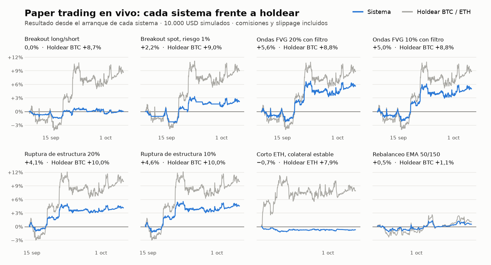

# Paper trading en vivo

[English](README.md) · **Español**

**Actualizado el 6 oct 2026.** Esta página la regenera un script una vez al día a partir del estado de los motores. El historial de commits de esta carpeta deja fechada cada foto.

| Sistema | En marcha desde | Resultado | Caída máxima | Operaciones | Holdear en el periodo |
|---|---|---|---|---|---|
| Breakout long/short | 8 sep | 0,0% | −1,9% | 11 | +8,7% |
| Breakout spot, riesgo 1% | 8 sep | +2,2% | −3,7% | 5 | +9,0% |
| Ondas FVG 20% con filtro | 8 sep | +5,6% | −3,4% | 2 | +8,8% |
| Ondas FVG 10% con filtro | 8 sep* | +5,0% | −3,2% | 2 | +8,8% |
| Ruptura de estructura 20% | 14 sep | +4,1% | −2,2% | 2 | +10,0% |
| Ruptura de estructura 10% | 14 sep* | +4,6% | −2,5% | 2 | +10,0% |
| Corto ETH, colateral estable | 18 sep | −0,7% | −1,3% | 1 | ETH +7,9% |
| Rebalanceo EMA 50/150 | 27 sep | +0,5% | −1,9% | 0 | +1,1% |

*\* Las variantes del 10% se añadieron el 22 de septiembre de 2026. Su histórico anterior se reconstruyó aplicando el nuevo tamaño a las señales ya ejecutadas.*

## Cómo leerlo

- **0 de 8 sistemas van por delante de holdear** su activo desde que arrancaron. El más antiguo lleva 27 días: es poco tiempo para concluir nada sobre rentabilidad.
- **Es dinero simulado.** Cada sistema parte de 10.000 USD ficticios. Ninguno tiene capital real.
- **Se publica todo, también lo que va mal.** La tabla sale tal cual del estado de los motores, sin elegir sistemas ni periodos.
- **Lo que esta fase comprueba es la operativa:** que el sistema en vivo hace lo mismo que el backtest.

Las reglas de cada sistema y sus backtests están en el [caso del laboratorio](../case-studies/02-paper-trading-lab/README.es.md). La equity diaria de cada sistema está en [`data/daily.csv`](data/daily.csv).

---

*Metodología: los motores leen el precio de Binance cada 15 segundos y registran la equity a precio de mercado cada minuto. El resultado y la caída máxima se calculan sobre ese registro. «Operaciones» cuenta las cerradas en los sistemas de breakout y las compras y ventas en los de rebalanceo. «Holdear» es la variación del precio del activo entre el arranque de cada sistema y la última lectura. Resultados simulados; no garantizan resultados futuros.*
