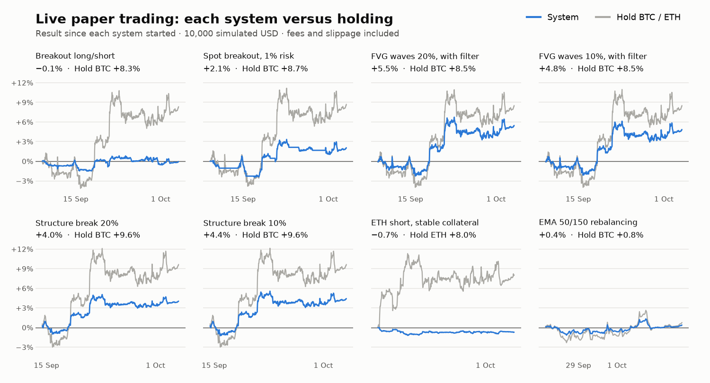

# Live paper trading

**English** · [Español](README.es.md)

**Updated on 4 Oct 2026.** A script regenerates this page once a day from the state of the engines. The commit history of this folder timestamps every snapshot.

| System | Running since | Result | Max drawdown | Trades | Holding over the period |
|---|---|---|---|---|---|
| Breakout long/short | 8 Sep | −0.1% | −1.9% | 11 | +8.3% |
| Spot breakout, 1% risk | 8 Sep | +2.1% | −3.7% | 5 | +8.7% |
| FVG waves 20%, with filter | 8 Sep | +5.5% | −3.4% | 2 | +8.5% |
| FVG waves 10%, with filter | 8 Sep* | +4.8% | −3.2% | 2 | +8.5% |
| Structure break 20% | 14 Sep | +4.0% | −2.2% | 2 | +9.6% |
| Structure break 10% | 14 Sep* | +4.4% | −2.5% | 2 | +9.6% |
| ETH short, stable collateral | 18 Sep | −0.7% | −1.3% | 1 | ETH +8.0% |
| EMA 50/150 rebalancing | 27 Sep | +0.4% | −1.9% | 0 | +0.8% |

*\* The 10% variants were added on 22 September 2026. Their earlier history was rebuilt by applying the new size to the signals already executed.*

## How to read it

- **0 of 8 systems are ahead of holding** their asset since they started. The oldest has been running for 25 days: too short to conclude anything about profitability.
- **It is simulated money.** Each system starts from 10,000 fictional USD. None has real capital.
- **Everything is published, including what goes badly.** The table comes straight from the state of the engines, with no picking of systems or periods.
- **What this phase checks is the operation:** that the live system does the same as the backtest.

The rules of each system and their backtests are in the [lab case study](../case-studies/02-paper-trading-lab/README.md). The daily equity of each system is in [`data/daily.csv`](data/daily.csv).

---

*Methodology: the engines read the Binance price every 15 seconds and record mark-to-market equity every minute. Result and max drawdown are computed on that record. "Trades" counts closed trades for the breakout systems and buys and sells for the rebalancing ones. "Holding" is the change in the asset's price between each system's start and the last reading. Simulated results; they do not guarantee future results.*
